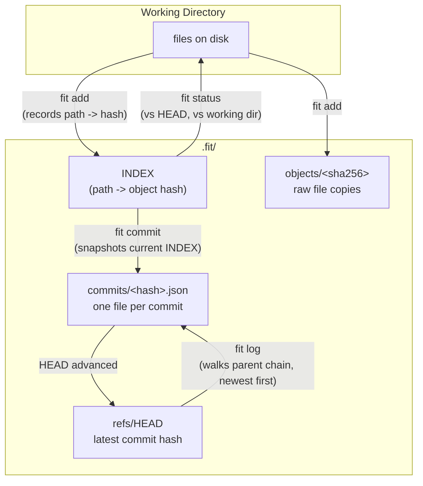

# fit

A minimal, educational version-control system in plain Go — zero external
dependencies, standard library only. Implements exactly what the
challenge asks for: `init`, `add`, `commit`, `status`, `log`, against a
`.fit` folder (name configurable).

## Architecture

```
cmd/
  fit/            -> CLI: parses arguments and dispatches to commands

internal/
  store/          -> content-addressed object store: raw file copies keyed by SHA-256
  index/          -> staging area (path -> object hash), persisted as JSON at <fitDir>/INDEX
  commitstore/    -> Commit objects (one JSON file per commit) + HEAD pointer
  repo/           -> porcelain commands (add/commit/status/log), wires the three together
```



**Why content-addressed?** Storing each file under the SHA-256 hash of its
content (`objects/<hash>`), rather than mirroring the working-directory
path, means: (1) any command that has a hash — from the index or from a
commit's `files` map — finds the exact copy in O(1); (2) identical content
is only ever stored once, even if added under different paths or added
twice unchanged; (3) `status` can tell "changed" from "unchanged" by
comparing hashes instead of re-diffing file content.

**Commit chain.** Each commit stores a `parent` field pointing at the
previous commit's hash — the same linked-list-of-snapshots model real Git
uses (just without merge commits, which this project doesn't need). `HEAD`
is a single file holding the latest commit's hash; `fit log` walks
`HEAD -> parent -> parent -> ...` and stops at 5 (or `-n <count>`).

## Commands

### `fit init [dir]`

Creates the `.fit` folder (or a custom name, see below) with every
subfolder the other commands need: `objects/`, `commits/`, `refs/`, plus
an empty `INDEX`. Fails if a repo already exists there.

### `fit add <path>...`

Copies each given file (or every file in a given directory, recursively)
into `.fit/objects/<sha256-of-its-content>`, and records
`path -> object hash` in `INDEX` — the staging area. Adding the exact
same content again is a cheap no-op (the object already exists); adding
changed content re-stages it under its new hash.

### `fit commit -m <message> [-author-name <name>] [-author-email <email>]`

Snapshots everything currently in `INDEX` into a new commit: a JSON file
at `.fit/commits/<hash>.json` containing a timestamp, the author's name
and email, the message, a unique hash, the previous commit's hash
(`parent`), and the `path -> object hash` snapshot itself. Advances
`refs/HEAD` to the new commit. Fails if nothing is staged, or if the
message is empty.

Author name/email default to `FIT_AUTHOR_NAME`/`FIT_AUTHOR_EMAIL` (env
vars), falling back to `fit-user`/`fit-user@localhost` if neither the
flags nor the env vars are set.

The commit hash is a SHA-256 over every field that makes the commit
unique (parent, author, timestamp, message, and the sorted file list) —
so it's fully deterministic from the commit's content, the same principle
real Git's commit hashing uses.

### `fit status`

Three sections, git-style:

- **Changes to be committed** — `INDEX` vs. `HEAD`'s snapshot: files
  staged that are new, changed, or removed relative to the last commit.
- **Changes not staged for commit** — working directory vs. `INDEX`:
  tracked files that were edited or deleted on disk since they were last
  `add`ed.
- **Untracked files** — files in the working directory that have never
  been `add`ed.

### `fit log`

Walks the commit chain from `HEAD`, newest to oldest, printing up to 5
commits (`-n <count>` to change that) — hash, author, date, and message
for each.

## Custom `.fit` folder name

The folder name is configurable, as the challenge allows ("`.fit` (nome
opcional)"): pass `-dir <name>` to any command, or set `FIT_DIR` in the
environment. `fit init -dir .myvcs` creates `.myvcs/` instead of `.fit/`;
every other command needs the same `-dir`/`FIT_DIR` to find it again.

## Running it

```bash
cd fit
go build -o fit ./cmd/fit
go test ./...

mkdir /tmp/fit-test && cd /tmp/fit-test
/path/to/fit init
echo "hello" > file.txt
/path/to/fit add file.txt
/path/to/fit status
/path/to/fit commit -m "first commit" -author-name "Ada Lovelace" -author-email "ada@example.com"
/path/to/fit log
```

I don't have a Go toolchain or internet access in the sandbox that
produced this code, so I couldn't actually run `go build`/`go test` here.
The code was reviewed manually — every cross-package function call was
checked against its declared signature, every import confirmed used, and
brace balance verified across every file — but please run the tests on
your machine before trusting this fully.

## Known limitations / design decisions

- No `.fitignore`: `fit add <dir>` stages every file it finds, recursively
  (skipping only the `.fit` folder itself).
- No branches — just a single linear chain of commits via `parent`. That
  matches what the challenge asks for (`log` walking commits "in creation
  order"); adding branches would mean tracking multiple named HEADs
  instead of one.
- Committing with an empty `INDEX` is refused rather than silently
  creating an empty commit — there would be nothing for it to record.
- `add` re-reads and re-hashes the whole file every time; fine for the
  file sizes this kind of exercise deals with, but real Git's stat-cache
  tricks (to skip re-hashing unchanged files) aren't implemented.
- Object copies are stored raw (no compression) — the challenge only asks
  for "a copy... easily found by other commands", which raw,
  content-addressed storage already satisfies; compression would add
  complexity without being part of the spec.
